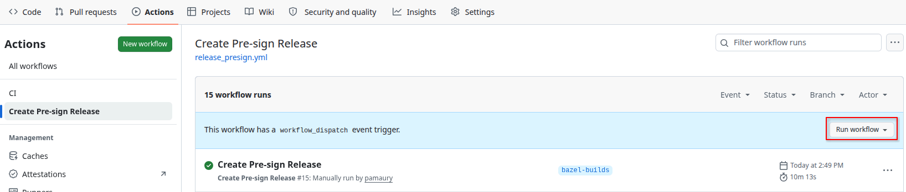
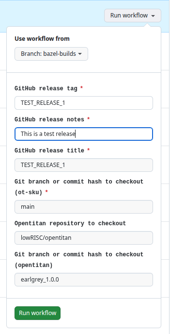
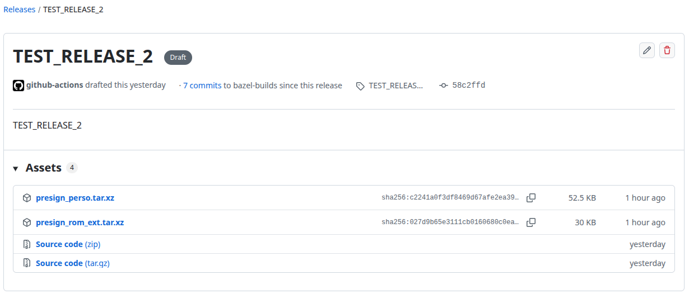
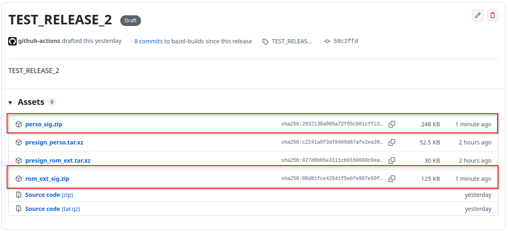

# Creating a release

Creating a release of the provisioning and RON_EXT artifacts is a multi-step process, most of which is automated using Github Actions.

## Step 1: creating pre-signing release artifacts

The first step consists in building the pre-sign artifacts. This step is completely automated using Github Actions.
- Select the `Create pre-sign release` workflow in the `Actions` of the repository.
  
- Click of the `Run workflow` button and fill out the parameters of the release:
  - The tag will be used to tag both the release and the branch.
  - The workflow supports cutting out a release from any branch of the `ot-sku` repository.
    It also supports using any OpenTitan repository and/or branch which is compatible with the `earlgrey_1.0.0` branch.

  
- If the workflow runs successfully, a draft release will be created with the pre-sign artifacts.
  

## Step 2: signing the artifacts

Signing the artifacts a manual, typically off-line, step.
The `presign_perso.tar.xz` and `presign_rom_ext.tar.xz` archives contains the digests and `hsmtool` instructions to execute.
This flow typically looks like this:
```bash
# Setup hsmtool environment to use either SoftHSM or a real HSM.
# Download presign_perso.tar.xz and presign_rom_ext.tar.xz
# Extract then.
mkdir presign_perso presign_rom_ext
tar -xvf presign_perso.tar.xz -C presign_perso
tar -xvf presign_rom_ext.tar.xz -C presign_rom_ext
# Execute signing.
pushd presign_perso
/path/to/hsmtool $HSMTOOL_CUSTOM_ARG exec provisioning_ot00.json
popd
pushd presign_rom_ext
/path/to/hsmtool $HSMTOOL_CUSTOM_ARG exec rom_ext.json
popd
# Zip everything.
zip -r perso_sig.zip presign_perso
zip -r rom_ext_sig.zip presign_rom_ext
```

At the end of this step, you must have two archives containing the signatures:
- `perso_sig.zip`
- `rom_ext_sig.zip`

## Step 3: create the post-signing release artifacts

The first step consists in building the final artifacts and release. This step is completely automated using Github Actions.
- First, you need to edit the draft release created in Step 1 and upload the `perso_sig.zip` and `rom_ext_sig.zip` archives obtained during Step 2.
  This can be done manually using the Github UI, or using the `gh` tool with a correctly configured token:
  ```bash
  gh release upload -R "$OWNER_REPO" "$RELEASE_TAG" perso_sig.zip rom_ext_sig.zip
  ```
  